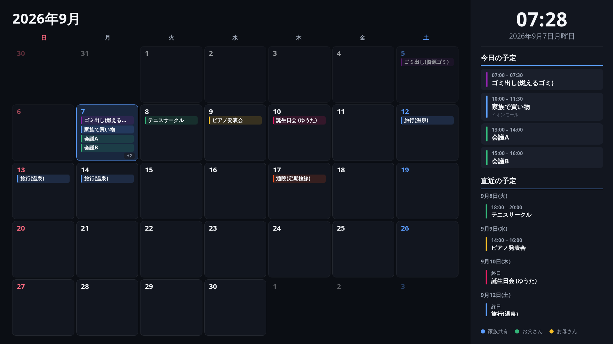

# MMM-CalendarforSignage

**家族共有の予定を、リビングの壁掛けカレンダーに書き込む感覚をそのままデジタル化する**ための [MagicMirror²](https://magicmirror.builders/) モジュールです。

[MMM-CalendarExt3](https://github.com/MMRIZE/MMM-CalendarExt3) や [MMM-MyGCalendar](https://github.com/johnster000/MMM-MyGCalendar) を参考に、フルHDモニターを**リビングのデジタルカレンダー端末（サイネージ）として常時表示する用途に特化**して新規に作成しました。

- 表示は **フルスクリーン専用**（`position: "fullscreen_below"` / `"fullscreen_above"` のみを想定）
- データソースは **iCal (.ics) URL** を解析（Google カレンダーの共有URL・非公開URLなど）
- **2〜3m離れて見る壁掛けカレンダー**を意識した、大きな文字・高コントラストのシンプルモダンなデザイン
- 月表示カレンダー＋「時計」「今日の予定」「直近の予定」「カレンダー凡例」のサイドパネル構成



---

## コンセプト

このモジュールは操作を前提としていません（タッチ操作・モーダル等は搭載していません）。
リビングの壁に貼ってあるカレンダーのように、**常時ついていて、ふと見れば今日・今週・家族の予定がひと目でわかる**ことを目的にしています。

- 大きな月表示グリッドで「今日がどこか」「今週何があるか」を一望
- 画面端のサイドパネルに時計・今日の予定・直近の予定をまとめて表示
- 家族ごと／用途ごとにカレンダーを分けて色分け表示（凡例つき）

---

## インストール

```bash
cd ~/MagicMirror/modules
git clone https://github.com/Ryuto-dev/MMM-CalendarforSignage.git
cd MMM-CalendarforSignage
npm install
```

## 更新

```bash
cd ~/MagicMirror/modules/MMM-CalendarforSignage
git pull
npm install
```

---

## iCal (.ics) URL の取得方法（Google カレンダーの例）

1. [Google カレンダー](https://calendar.google.com) を開く
2. 対象カレンダーの **⋮ → 設定と共有**
3. **「カレンダーの統合」** までスクロール
4. 家族共有カレンダーが誰でも見られる設定なら **「公開URL(iCal形式)」**、そうでなければ **「非公開URL(iCal形式)」** をコピー
   ```
   https://calendar.google.com/calendar/ical/xxxx%40group.calendar.google.com/private-xxxxxxxx/basic.ics
   ```
5. `config.js` の `url` に貼り付ける

> **注意:** 非公開URLは実質パスワード相当です。第三者に共有しないでください。

他のカレンダーサービス（iCloud, Outlook など）でも、iCal形式で書き出せるURLがあれば同様に利用できます。

---

## 設定例

`config/config.js` の `modules` 配列に、**必ずフルスクリーン系の position** で登録してください。

```javascript
{
  module: "MMM-CalendarforSignage",
  position: "fullscreen_below", // fullscreen_above でも可。他の position は非対応
  config: {
    calendars: [
      {
        name: "家族共有",
        url: "https://calendar.google.com/calendar/ical/xxxx%40group.calendar.google.com/private-xxxx/basic.ics",
        color: "#5B9DFF"
      },
      {
        name: "お父さん",
        url: "https://calendar.google.com/calendar/ical/father%40example.com/private-xxxx/basic.ics",
        color: "#33B679"
      }
    ],
    sidebarPosition: "right",
    upcomingDays: 5,
    maxEventsPerDay: 4,
    theme: "dark",
    colorRules: [
      { keyword: "誕生日", color: "#E91E63" },
      { keyword: "ゴミ|ごみ", color: "#8E24AA" }
    ]
  }
}
```

サンプル一式は [`example/config.sample.js`](example/config.sample.js) を参照してください。

### 設定オプション一覧

| オプション             | デフォルト               | 説明                                                                 |
|------------------------|--------------------------|----------------------------------------------------------------------|
| `calendars`            | `[]`                     | `{ name, url, color }` の配列。表示するiCalソース                     |
| `updateInterval`       | `600000`（10分）         | iCal再取得の間隔 (ms)                                                 |
| `weekStartsOnMonday`   | `false`                  | `true` で月曜始まりの週レイアウト                                     |
| `sidebarPosition`      | `"right"`                | サイドパネル（時計・予定一覧）の位置。`"left"` / `"right"`            |
| `upcomingDays`         | `5`                      | 「直近の予定」に表示する日数（今日を除く）                            |
| `maxEventsPerDay`      | `4`                      | 月表示1マスに表示する予定の最大数。超過分は `+N` 表示                  |
| `showLegend`           | `true`                   | カレンダーごとの色分け凡例を表示するか                                 |
| `showSeconds`          | `false`                  | 時計に秒を表示するか                                                   |
| `theme`                | `"dark"`                 | `"dark"` / `"light"`                                                  |
| `colorRules`           | `[]`                     | タイトルキーワードによる色の上書き。`[{ keyword, color }]`             |
| `locale`               | `"ja-JP"`                | 日付・時刻表記に使うロケール                                           |
| `fadeSpeed`            | `800`                    | データ更新時のフェード速度 (ms)                                       |
| `debug`                | `false`                  | デバッグログ出力                                                       |

### `colorRules` について

iCalフィード（特にGoogleカレンダーの書き出し）はイベント単位の色情報を持たないことが多いため、タイトルの**キーワード一致（正規表現・大文字小文字無視）**で色を上書きできます。上から順に評価され、最初にマッチしたルールが採用されます。

色の決定優先順位: **iCalの`COLOR`プロパティ**（対応ソースのみ） → **`colorRules`のキーワード一致** → **カレンダーごとの既定色 (`calendars[].color`)**

---

## 画面レイアウト

```
┌───────────────────────────────────────────┬───────────────┐
│                                             │   14:32       │
│              2026年 9月                    │ 9月7日(月)    │
│  日  月  火  水  木  金  土                │───────────────│
│ ┌──┬──┬──┬──┬──┬──┬──┐                │ 今日の予定     │
│ │  │  │  │ 1│ 2│ 3│ 4│                │ ・ 10:00 検診  │
│ ├──┼──┼──┼──┼──┼──┼──┤                │───────────────│
│ │ 5│ 6│●7│ 8│ 9│10│11│  ← 今日強調      │ 直近の予定     │
│ ├──┼──┼──┼──┼──┼──┼──┤                │ 9/8(火)        │
│ │  ...                    │                │ ・ゴミ出し    │
│ └──┴──┴──┴──┴──┴──┴──┘                │───────────────│
│                                             │ ● 家族共有    │
│                                             │ ● お父さん    │
└───────────────────────────────────────────┴───────────────┘
```

- **メイン**: 月表示カレンダー。今日のマスをハイライトし、各マスに予定チップを表示
- **サイド**: 時計／今日の予定／直近の予定（先の日ほど省略表示）／カレンダー凡例

`sidebarPosition: "left"` にすると左右反転します。

---

## 動作環境

- MagicMirror² 本体
- Node.js（MagicMirror本体が動作する環境と同一）
- 依存パッケージ: [`node-ical`](https://www.npmjs.com/package/node-ical)（`npm install` で導入）

## ライセンス

MIT
